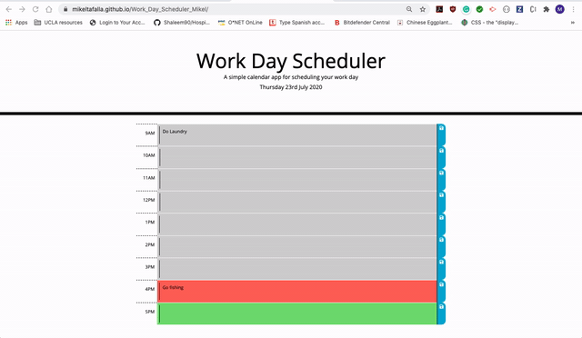

# Work-day-schedule

Client side application records work day tasks in time slots. Schedule tasks for later in the day in the green slots or current time in the red slot. Tasks that have already be done will be displayed in the grey slots. Time slots will change color dyamically based on current time of day.

[Link to page](https://musicman785.github.io/Work-day-schedule/)

# Technologies Used

> 1. Html
> 2. CSS
> 3. Javascript
> 4. Moment Api

# Table of Contents

- [Instructions](#instructions)
- [License](#license)
- [Contributors](#contributors)
- [Gif](#gif)
- [Author](#author)

## Instructions

> Open your browser. Navigate to https://musicman785.github.io/Work-day-schedule/ and hit enter. Once browser window opens, begin entering work day tasks by clicking in input field and hit save icon to save talk into field. To remove task simply click in input field once more clear text and click save icon again.

## License

[Not Applicable](#)

## Contributors

## Gif:

[/assets/images/giffy.gif]()

[musicman785](http://github.com/musicman785)

## Gif

## Author

**musicman785**

Email: null

Location: Los Angeles

Github: https://github.com/musicman785
